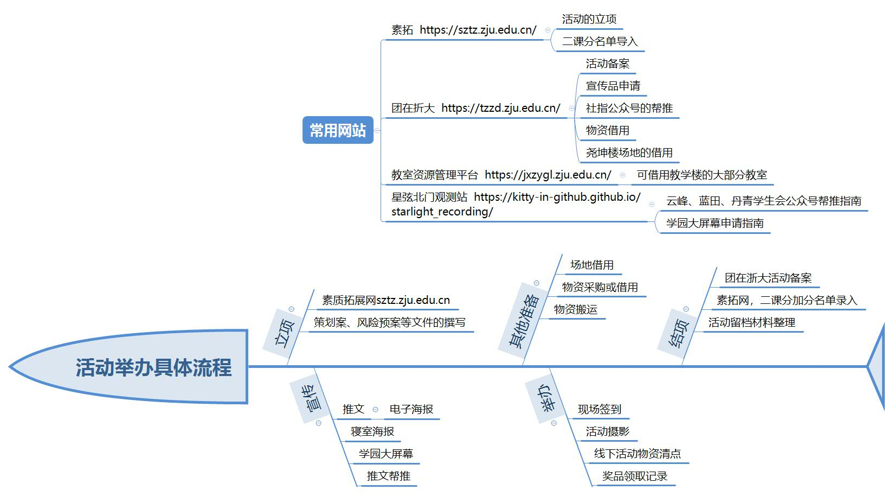

# 角色扮演指南

***人靠衣装马靠鞍***

摘要 | 介绍这些角色在我们社团的作用，明确这些角色应该承担的责任

上次更新时间 2026/1/23

天天开心

## 部长：活动主要负责人/总指挥
社团的主力军、我们的神经元。你需要做的事情包括以下这些：

1. 从经过内训的干员中招募活动项目组的人手
2. 确定活动的举办日期
3. 对新干员进行内训
4. 在社长放鸽子（通常永远都是这样）时，承担活动的必要流程，这些流程包括
	1. 素质拓展网，活动立项。素拓网立项后我们才能给参与者们申请二课分。
	2. 素质拓展网，导入二课分加分名单。这一步需要在活动举办后及时完成——如果你忘记了，**可能会有某个缺少二课分的学长因此延毕！**
	3. 团在浙大，学生活动申请
	4. 团在浙大，活动备案
	5. 团在浙大，基金项目申请审批流程
	6. 报销流程
	7. 教室借用
5. 收集活动的照片，用于纪念、写推文、跑流程
6. 收集活动的报销材料
7. 监督活动进程，分派举办活动所需的任务

你可以拿这幅图作为参考

[举办活动](TheFullProgressOfHoldingClubActivities.md)

## 社长
为了爱戴上枷锁的傻瓜。当社团不健康时，你需要承担几乎所有的工作；而在社团较为健康时，你至少也需要做到以下的事情：

1. 物色社长候选人
2. 物色和培养下一任部长
3. 外联工作，负责和其他高校幻协、校外组织和企业、校内其他社团、社团指导中心和指导老师的联络和接洽。
4. 召开和主持全员大会
5. 努力学习，争取保研/留校。这可以将你的苦役从一年延长到三年。
6. 整理社团的留档文件
	- 设计品
	- 设计素材
	- 策划案、安全方案等活动记录
	- 活动照片
	- 活动日志和总结

## 干员
对于一个健康发展的社团来说，干员是，同时也是社团各级负责人的储备军。如果你准备好干活了，下面是你可以注意的方面：

1. 按照兴趣积极参加内训。我们的内训大多数是领进门。如今传媒发达，教程满天飞；而我们的教师也是学生。我们会帮你领进门，使你们的水平达到“可以承担社团工作”；而职业化、专业化，需要靠你们自学——入门阶段，教学效率高，入门之后，自学的效率高。
2. 在学习之余承担社团工作，包括主持讨论会秩序、活动拍照、收集报销材料、填写表单等。
3. 根据自己的喜好和心情参加社团周例小聚会，玩玩桌游，看看电影，一起出去吃个饭。注意交通安全，也许趁这个机会解决一下自己的人生大事。

社团的所有工作，目前被划分为：线下、设计、行政、策划、AI绘画五类，此外有兴趣组队参加大学生游戏设计竞赛的同学额外有一个”游戏工作室“的分工选项

- 线下工作：包括场务、活动拍照、主持会议、电影放映、摆摊活动摊位值班、组织约饭约牌局等线下内建活动。有时给行政组的同学帮帮忙递送一些表单；
- 设计工作：设计各种宣传品和周边，将已有的推文文案排版成微信公众号推文，使用AI辅助你的创作。一些工作成果举例，传单、海报、易拉宝、社刊封面、钥匙扣、明信片、书签、动态海报（15s时长的视频）；
- 行政工作：处理各种表单，撰写通知和推文，评审采购方案是否合规，为社团的各种答辩准备ppt，辅助[本学期活动主要负责人](HumanResources/OurDuty.md)处理行政流程，如借教室、活动立项、推文帮推、线下宣传品申请等；
- 策划工作：想出新活动，撰写策划案，落实和指导干员落实策划案（成为活动主要负责人）；
- AI绘画：使用AI绘画，为社团的设计工作提供素材、为社刊提供配图，承担此项工作需要拥有一台显卡功能强大的电脑（以便拥有舒适的AI绘画体验）

## 星弦游戏工作室
参加大学生游戏设计竞赛的团队，分工大致有策划、程序、美术三类，同时包含若干个兼职或转职的测试

以一个五人队伍为例，其具体分工可以如下

- 主策：通常也是队长，需要负责起草整个游戏的设计方案、故事背景设定等。最好能懂一点程序，以便和主程序做好对接
- 主程序：负责监督游戏工程的结构，并承担主要的变成工作
- 数值策划：通常兼任试玩。需要反复游玩游戏、调整数值，以优化游戏体验
- 主美术：负责绘制程序种使用到的美术素材
- 程序美术：主要负责动态视觉效果，同时辅助程序工程结构。很多动态视觉效果如果完全采用绘制方法（例如视频）会占据大量储存空间。程序美术的工作是”用性能换空间“。

## 社员
社团因你而存在。

## 常用链接
[团在浙大](http://10.202.82.70/)

[素质拓展网](https://sztz.zju.edu.cn/)

[教室资源管理平台](https://jxzygl.zju.edu.cn/)