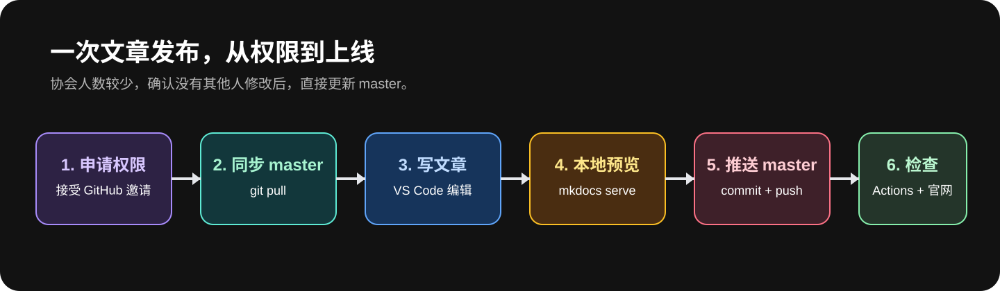
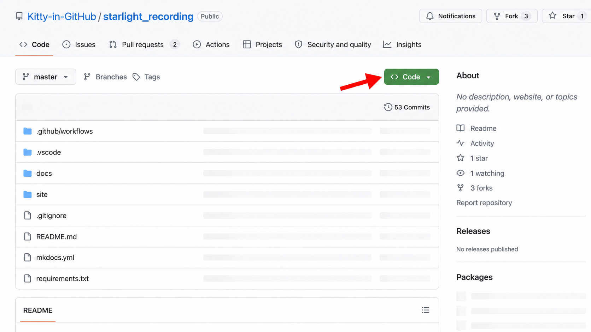
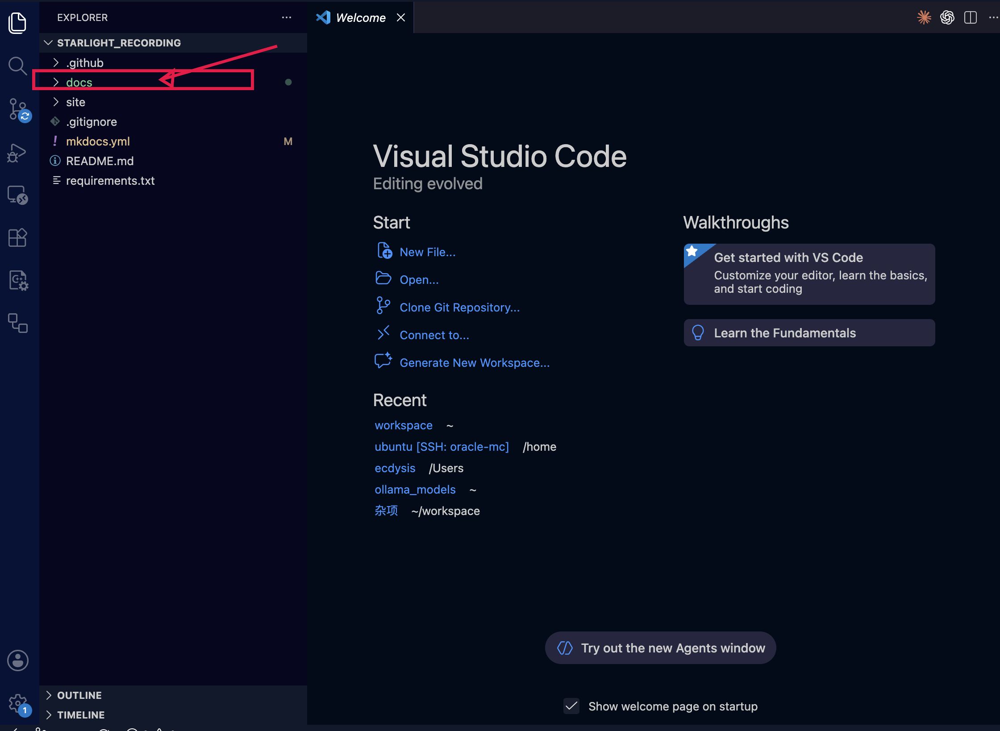
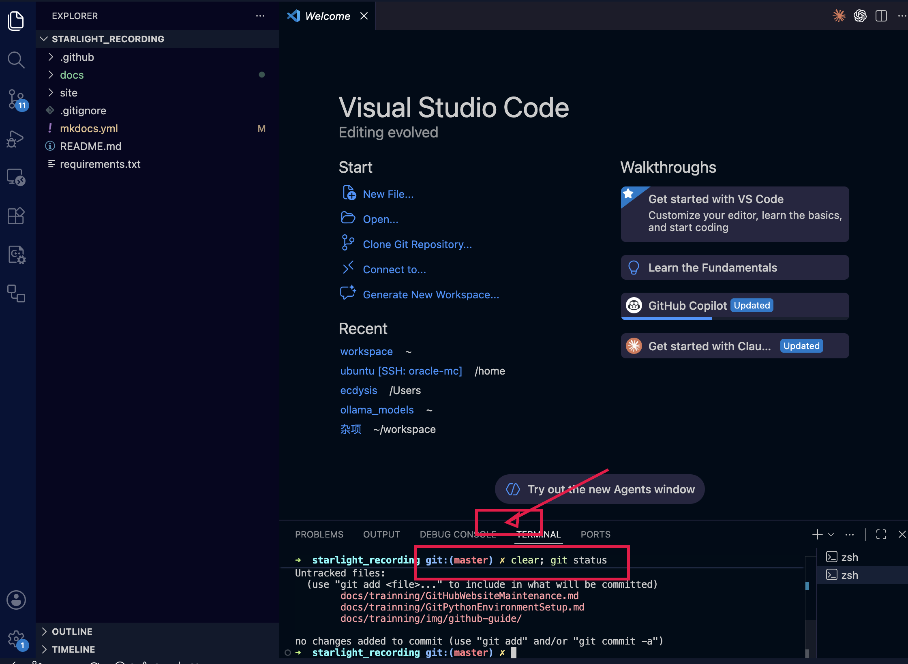
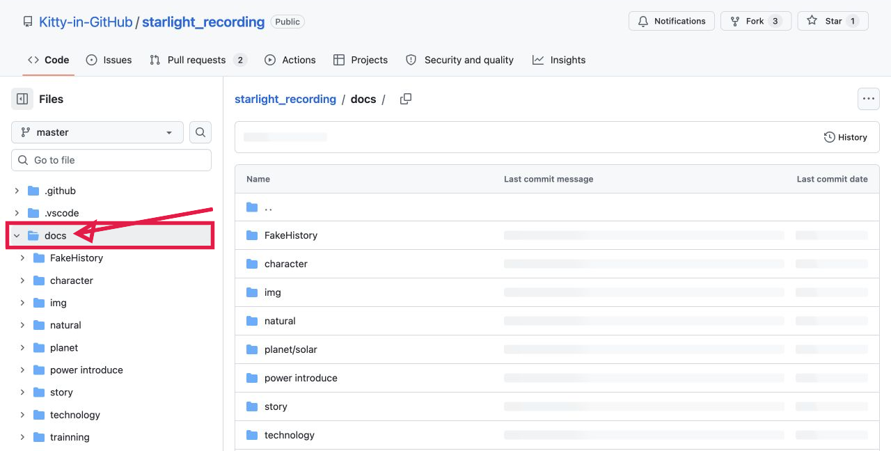
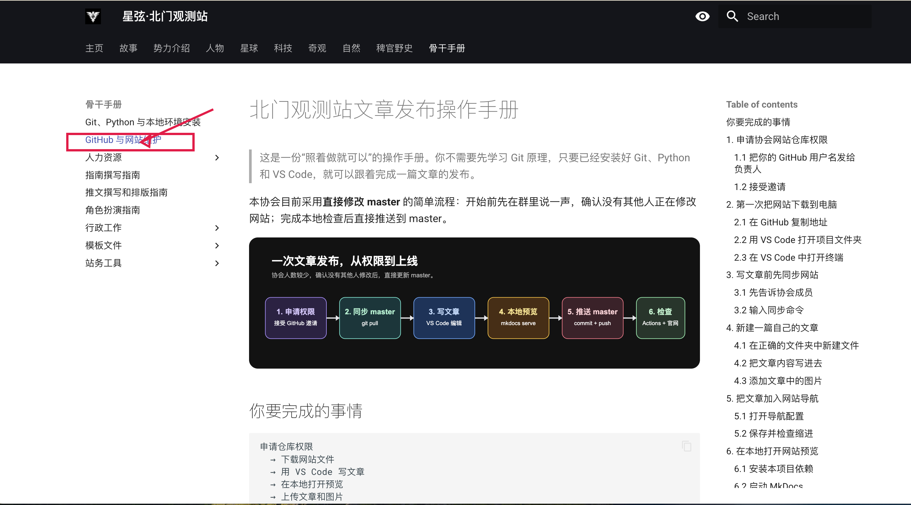
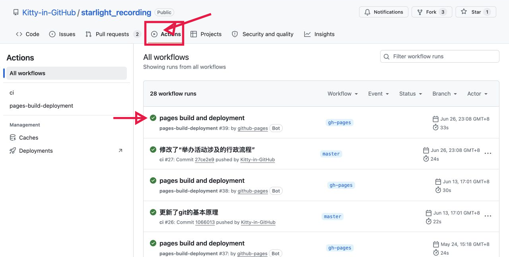

# 北门观测站文章发布操作手册

> 这是一份“照着做就可以”的操作手册。你不需要先学习 Git 原理，只要已经安装好 Git、Python 和 VS Code，就可以跟着完成一篇文章的发布。

本协会目前采用**直接修改 master** 的简单流程：开始前先在群里说一声，确认没有其他人正在修改网站；完成本地检查后直接推送到 master。



## 你要完成的事情

```text
申请仓库权限
  → 下载网站文件
  → 用 VS Code 写文章
  → 在本地打开预览
  → 上传文章和图片
  → 检查正式网站
```

Git、Python 和 VS Code 的安装请先看：[Git、Python、VS Code 与本地环境安装指南](GitPythonEnvironmentSetup.md)。

---

## 1. 申请协会网站仓库权限

### 1.1 把你的 GitHub 用户名发给负责人

打开 <https://github.com/> 并登录。点击右上角头像，你会看到自己的用户名。把这个用户名发给协会网站负责人，请对方把你加入网站仓库的协作者。

不要把 GitHub 密码、验证码、Personal Access Token 或 OAuth 密钥发给任何人；负责人只需要你的用户名。

### 1.2 接受邀请

负责人发出邀请后，你会在 GitHub 通知、注册邮箱或仓库页面看到邀请。点击 **Accept invitation**，再重新打开协会仓库。

> **图 1｜协会仓库主页（真实截图）。** 先确认浏览器打开的是 Kitty-in-GitHub/starlight_recording，分支下拉框显示 master，页面能看到绿色 **Code** 按钮。



如果打开仓库显示 404、没有文件，或看不到负责人说的仓库，请把页面截图发给负责人，不要重复申请多个账号。

---

## 2. 第一次把网站下载到电脑

这一步只做一次。以后每次写文章，从第 3 节开始。

### 2.1 在 GitHub 复制地址

1. 打开协会网站仓库主页。
2. 点击绿色 **Code**。
3. 确认选择 **HTTPS**。
4. 点击右侧复制图标。


### 2.2 用 VS Code 打开项目文件夹

1. 打开 VS Code。
2. 点击 **File → Open Folder…**。
3. 选择网站文件夹 starlight_recording。
4. 点击 **Open**。

打开成功后，左侧 **Explorer** 应看到 docs、site、mkdocs.yml 和 requirements.txt。



如果电脑还没有这个文件夹，在 VS Code 的终端中输入下面三行；把尖括号替换为刚才复制的地址：

```shell
git clone <协会网站仓库的 HTTPS 地址>
cd starlight_recording
code .
```

### 2.3 在 VS Code 中打开终端

在 VS Code 顶部菜单点击 **Terminal → New Terminal**。终端会出现在窗口下方。

确认终端路径最后是 starlight_recording，然后输入：

```shell
git status
```

如果看到 On branch master，就可以继续。第一次操作如果看到文件列表，也不要害怕；先截图联系负责人确认。



---

## 3. 写文章前先同步网站

### 3.1 先告诉协会成员

在协会工作群说：“我现在准备修改网站，预计修改 XXX 页面。”确认没有其他人正在编辑同一页面后再继续。

### 3.2 输入同步命令

在 VS Code 下方的终端中，一行一行复制并按回车：

```shell
git switch master
git pull origin master
```

看到 Already up to date. 表示你电脑里的版本已经是最新的；看到一串更新文件也通常表示同步成功。

如果负责人通知你有人正在维护网站，请先等待，不要同时推送。

---

## 4. 新建一篇自己的文章

下面以“新建一篇站务教程”为例。你可以把文件名和文章内容换成自己的主题。

### 4.1 在正确的文件夹中新建文件

在 VS Code 左侧 **Explorer** 中：

1. 展开 docs。
2. 展开 trainning。
3. 右键点击 trainning 文件夹。
4. 点击 **New File**。
5. 输入文件名，例如 MyFirstGuide.md，按回车。

文件名建议只使用英文、数字和下划线。比如：

```text
MyFirstGuide.md
ActivityGuide.md
2026SpringPlan.md
```

### 4.2 把文章内容写进去

在新文件中复制下面这个模板，再替换标题和正文：

```markdown
# 文章标题

这里写一两句话，说明这篇文章是做什么的。

## 第一个小标题

这里写正文。

## 第二个小标题

- 第一项
- 第二项
```

写完后按 Command + S（macOS）或 Ctrl + S（Windows）保存。保存只会改你电脑里的文件，还没有上传。

保存后，中间编辑区的文件名旁边会出现修改标记；这是正常的，等第 7 节的 `git add`、`git commit` 和 `git push` 才会上传。

### 4.3 添加文章中的图片

把图片文件复制到文章对应的图片文件夹。骨干手册文章的图片放在：

```text
docs/trainning/img/
```

在 VS Code 左侧把图片拖进这个文件夹，或者直接把图片复制到该文件夹。文件名建议使用英文，例如 borrow-classroom-step1.png。

在文章中写：

```markdown

```

保存后，图片引用的文件名必须与实际文件名完全一致，包括大小写。

---

## 5. 把文章加入网站导航

只新建 Markdown 文件，网站左侧导航中还找不到它。还需要修改根目录的 mkdocs.yml。

### 5.1 打开导航配置

在 VS Code 左侧点击根目录的 mkdocs.yml。找到你希望放文章的栏目。例如“骨干手册”现在是：

```yaml
  - 骨干手册:
    - Git、Python 与本地环境安装: trainning/GitPythonEnvironmentSetup.md
    - GitHub 与网站维护: trainning/GitHubWebsiteMaintenance.md
```

在相同的缩进位置增加一行：

```yaml
    - 我的第一篇教程: trainning/MyFirstGuide.md
```

左侧文字是网站上显示的标题，右侧是文件从 docs 开始的路径。

### 5.2 保存并检查缩进

按 Command + S / Ctrl + S 保存。YAML 缩进只能使用空格，不要按 Tab。新增行必须和相邻的文章保持同样的缩进。

如果你不确定放在哪个栏目，先不要修改导航，截屏发给负责人确认。



---

## 6. 在本地打开网站预览

### 6.1 安装本项目依赖

在 VS Code 下方终端确认当前路径是 starlight_recording，然后根据系统输入：

macOS：

```shell
python3 -m pip install -r requirements.txt
```

Windows：

```shell
py -m pip install -r requirements.txt
```

第一次安装可能需要等待几分钟；看到命令重新出现输入光标，通常表示完成。

### 6.2 启动 MkDocs

继续在同一个终端输入：

```shell
mkdocs serve
```

终端出现 Serving on http://127.0.0.1:8000/ 后，按住 Command / Ctrl 点击网址，或复制到浏览器打开。



打开文章后检查：

- 新文章能否从导航找到；
- 标题和正文是否正常；
- 图片是否显示；
- 有没有红色报错；
- mkdocs.yml 修改后导航有没有错位。

修改文件并保存后，浏览器一般会自动刷新。预览结束时回到终端按 Ctrl + C 停止服务。

如果出现 YAML 报错、找不到图片或页面打不开，先不要上传，截取终端完整报错联系负责人。

---

## 7. 把文章上传到 GitHub

确认本地预览没有问题后，在 VS Code 终端按顺序执行。

### 7.1 查看要上传的文件

```shell
git status
```

只应该看到你刚才新增或修改的文章、图片和 mkdocs.yml。如果出现你不认识的文件，先停止。

### 7.2 加入、提交、推送

把命令中的路径替换为你自己的文件：

```shell
git add docs/trainning/MyFirstGuide.md
git add docs/trainning/img/borrow-classroom-step1.png
git add mkdocs.yml
git commit -m "docs: add my first guide"
git push origin master
```

如果文章没有图片，可以不写第二条 git add。每一条命令输入后按回车，看到下一行输入光标再输入下一条。

提交说明要写清楚改了什么，例如：

```text
docs: add borrowing classroom guide
docs: add 2026 spring activity plan
fix: correct image path in publicity guide
```

> **重要：** git push origin master 会直接更新协会仓库。执行前必须再次确认：本地预览没问题、群里没人同时修改、git status 中没有无关文件。

---

## 8. 检查网站是否真的更新

推送完成后，打开 GitHub 仓库的 **Actions** 标签。等待最新的一次工作流出现绿色成功标志。



看到成功后，打开协会正式网站，进入你新增的栏目检查文章。若 Actions 红色失败，点击进去查看错误；不要反复推送相同内容，先把错误截图发给负责人。

---

## 9. 这套简单流程的约定

- 每次开始前在群里说一声，避免两个人同时改 master。
- 只修改自己负责的文章、图片和必要的导航行。
- 不要手动修改 site。
- 上传前一定要运行 mkdocs serve。
- 不要提交密码、Token、OAuth 密钥或私人资料。
- 发现冲突、红色报错或不确定的文件，停止并截图求助。

## 10. 发布前检查清单

- [ ] 已获得协会仓库访问权限。
- [ ] 已在 VS Code 打开整个 starlight_recording 文件夹。
- [ ] 已执行 git switch master 和 git pull origin master。
- [ ] 文章文件放在正确的 docs 子目录。
- [ ] 图片放在 docs 内，并用相对路径引用。
- [ ] 新文章已加入 mkdocs.yml 导航。
- [ ] 本地 mkdocs serve 页面检查通过。
- [ ] git status 中没有无关文件。
- [ ] 已完成 git add、git commit、git push origin master。
- [ ] GitHub Actions 成功，正式网站能打开文章。
