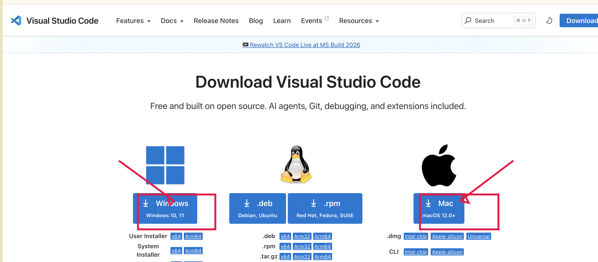

# Git、Python、VS Code 与本地环境安装指南

> 这是《[使用 VS Code 维护北门观测站](GitHubWebsiteMaintenance.md)》的前置文章。
>
> 如果你已经安装 VS Code，并能在它的终端中看到 Git 和 Python 的版本号，可以跳过本文。

## 先做一个选择

你需要安装 VS Code、Git 和 Python；只有 Miniconda 是可选的：

- **Windows：** 安装 Git for Windows 和 Python 官方安装包；不要安装 Homebrew。
- **macOS：** 推荐使用 Homebrew 安装 Git 和 Python；也可以改用 Python 官方安装包。
- **Miniconda：** 是 Python 的另一种管理方式，只有在你已经使用 Conda，或站务负责人明确要求时才安装。

对于第一次维护网站的新成员，推荐按“操作系统 + 官方安装方式”完成即可。Homebrew 和 Miniconda 不是 GitHub 必需品，也不是 VS Code 的插件。

---

## 1. 安装 Visual Studio Code

VS Code 是我们打开网站文件、编辑 Markdown 和运行终端命令的地方。请只从官方页面下载：<https://code.visualstudio.com/download>。



### Windows

1. 在下载页点击 **Windows**。
2. 下载完成后双击安装程序。
3. 安装选项保持默认即可；如果看到 **Add to PATH** 或“添加到 PATH”，请勾选它。
4. 点击 **Install**，完成后点击 **Finish**。

### macOS

1. 在下载页点击 **Mac**。
2. 如果是 M 系列芯片（M1/M2/M3/M4），选择 **Apple silicon**；如果是 Intel 芯片，选择 **Intel chip**。
3. 打开下载的 `.dmg` 文件，把 **Visual Studio Code** 拖到 **Applications（应用程序）** 文件夹。
4. 从“应用程序”打开 VS Code；第一次弹出安全提示时点击 **打开**。

安装完成后，打开 VS Code，看到欢迎页就说明安装成功。暂时不需要安装任何扩展；教程后面会直接使用左侧 **Explorer** 和下方的 **Terminal**。

## 2. 安装 Git

Git 负责记录文件修改、创建分支，并把本地修改同步到 GitHub。

### Windows：Git for Windows

1. 在浏览器打开 <https://git-scm.com/download/win>。
2. 下载并运行安装程序。
3. 安装选项第一次可以全部保持默认，连续点击 **Next**，最后点击 **Install**。
4. 安装完成后重启 VS Code。

在 VS Code 中选择 **终端 → 新建终端**，输入：

```shell
git --version
```

看到类似 `git version 2.x.x` 的文字，就安装成功了。

> **截图 A1｜Git for Windows 下载页。** 红框标出下载入口；不要把下载网站上的广告按钮当成 Git 安装按钮。
>
> **截图 A2｜Windows Git 版本检查。** VS Code 终端中显示 `git --version` 和版本号。

### macOS：使用 Homebrew（推荐）

Homebrew 是 macOS 的命令行软件包管理工具。它不是 Git，但可以帮你安装和更新 Git、Python 等工具。

1. 在浏览器打开 <https://brew.sh/zh-cn/>。
2. 复制网页上的安装命令。
3. 打开 VS Code 的终端，粘贴命令并按回车。
4. 安装过程中可能要求输入 macOS 登录密码。输入时终端不会显示字符，这是正常的；输入完成后按回车。
5. 安装完成后关闭并重新打开 VS Code。

检查 Homebrew：

```shell
brew --version
```

再安装 Git：

```shell
brew install git
```

最后检查：

```shell
git --version
```

> **截图 A3｜macOS Homebrew 官网。** 红框标出安装命令；截图中不要包含个人用户名或终端历史中的私人信息。
>
> **截图 A4｜macOS 安装 Git。** 终端显示 `brew install git` 完成后，再显示 `git --version` 的版本号。

### 不想使用 Homebrew？

也可以打开 <https://git-scm.com/download/mac> 安装官方 Git 包。安装完成后，在 VS Code 终端运行 `git --version` 验证即可；两种方式不要重复安装。

---

## 3. 安装 Python 3

MkDocs 是用 Python 运行的。我们需要的是 **Python 3**，不是 Python 2。

### Windows：Python 官方安装包

1. 打开 <https://www.python.org/downloads/windows/>。
2. 下载最新的 Python 3 安装程序。
3. 安装开始页面中，务必勾选 **Add python.exe to PATH**。
4. 点击 **Install Now**。
5. 安装完成后重启 VS Code。

在终端运行：

```shell
py --version
```

看到类似 `Python 3.12.x` 即可。Windows 教程中优先使用 `py` 命令，避免系统中同时存在多个 Python 时找错版本。

> **截图 A5｜Windows Python 安装页。** 红框标出 **Add python.exe to PATH**；这是新人最容易漏掉的选项。
>
> **截图 A6｜Windows Python 版本检查。** 终端中显示 `py --version` 和 `Python 3.x.x`。

### macOS：使用 Homebrew

如果上一节已经安装 Homebrew，可以运行：

```shell
brew install python
```

然后检查：

```shell
python3 --version
python3 -m pip --version
```

两条命令都显示版本号即可。

### macOS：使用 Python 官方安装包

不使用 Homebrew 时，打开 <https://www.python.org/downloads/macos/>，下载 Python 3 安装包并按默认选项安装。重启 VS Code 后检查：

```shell
python3 --version
```

看到 `Python 3.x.x` 即可。

> **截图 A7｜macOS Python 检查。** 终端中依次显示 `python3 --version` 和 `python3 -m pip --version`。

---

## 4. Miniconda 是什么？什么时候安装？

Miniconda 是一个较轻量的 Conda 安装程序，可以为不同项目分别管理 Python 环境。它对科研、数据分析和需要很多 Python 包的项目很有用，但维护协会 MkDocs 网站并不强制需要它。

如果负责人要求你使用 Miniconda：

1. 从官方页面下载对应系统版本：<https://docs.conda.io/projects/miniconda/en/latest/>。
2. Windows 按安装程序默认选项安装；macOS 按系统芯片选择 Apple Silicon 或 Intel 版本。
3. 安装完成后重启 VS Code。
4. 终端运行：

```shell
conda --version
```

看到版本号后，再按负责人提供的项目环境命令操作。

> **不要同时用 Homebrew Python 和 Miniconda Python 创建同一个 MkDocs 环境。** 如果终端提示 `python`、`python3` 和 `conda` 指向不同位置，先暂停并求助。
>
> **截图 A8｜Miniconda 版本检查。** 终端显示 `conda --version`；图注强调“Miniconda 是可选工具，不是 GitHub 的必需安装项”。

---

## 5. Git 的首次身份设置

Commit 中会记录作者名称和邮箱。它不负责登录 GitHub，只是给修改留下署名。

把下面两条命令中的内容替换成你希望显示的姓名和邮箱：

```shell
git config --global user.name "你的姓名或 GitHub 用户名"
git config --global user.email "你的 GitHub 邮箱"
```

检查是否保存成功：

```shell
git config --global --list
```

> 不要把访问令牌、密码或 OAuth client secret 写入 `user.email`，也不要把 `git config --global --list` 的完整输出公开到群里；其中可能包含个人邮箱。

---

## 6. 安装完成验收

在 VS Code 中打开一个新终端，根据系统运行：

### Windows

```shell
git --version
py --version
```

### macOS

```shell
git --version
python3 --version
```

看到 Git 版本号和 Python 3 版本号后，再回到主教程的[第 1 节](GitHubWebsiteMaintenance.md#1-认识协会网站仓库)开始。

如果仍然失败，请一次性提供：操作系统、你输入的完整命令、终端完整报错截图。不要只发“运行不了”。

## 安装问题速查

| 问题 | 可能原因 | 处理 |
| --- | --- | --- |
| `git` 找不到 | Git 未安装，或 VS Code 尚未重启 | 重启 VS Code；仍失败则重新检查 Git 安装 |
| Windows 找不到 `py` | Python 安装时没加入 PATH | 重新运行安装程序并勾选 **Add python.exe to PATH** |
| macOS 找不到 `brew` | Homebrew 安装未完成或终端未重启 | 重启 VS Code，检查安装命令的最后几行 |
| `python` 与 `python3` 版本不一致 | 电脑上有多套 Python | 不要自行删除；截图后联系负责人 |
| `pip` 权限错误 | 使用了系统 Python 或权限不足 | 优先使用 `python3 -m pip` / `py -m pip`，不要加 `sudo` |
