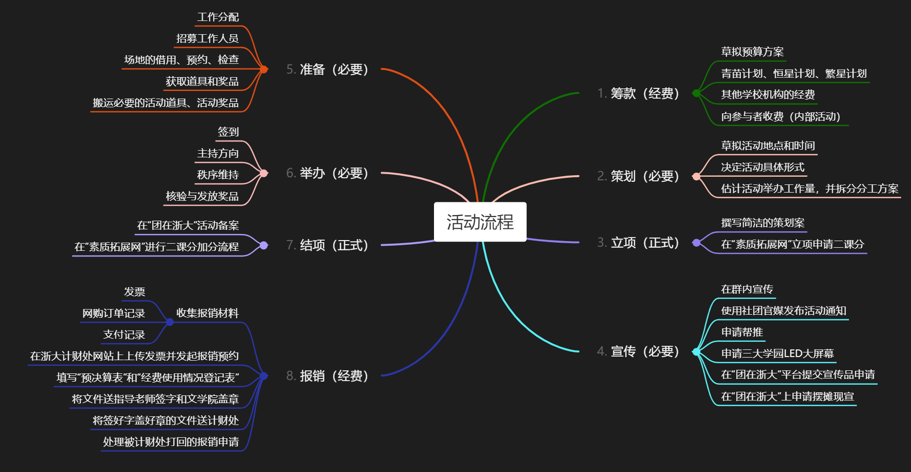

# 举办活动涉及的行政流程
***社团运作的基本单元——活动***

本篇指南主要有关举办活动过程中涉及的**行政流程**，包括立项、宣传、现场记录、采购与报销、活动后备案等。

任何活动都包含策划、宣传、准备、举办环节；对于申请二课分的正式活动，额外多了立项、结项环节；对于使用经费的活动，又额外多了经费筹集、事后报销环节。

## 策划

策划一个活动，首先需要想出有趣的活动内容，然后需要为活动选择合适的时间地点，并评估后续工作。如有必要需要为活动拟定合适的奖品，

社团举办活动主要是为了丰富学生们的课余生活、满足学生的社交需求。我们的主要竞争对手是低质量的短视频和电子游戏。在策划活动时，您可以围绕增强社交属性、制造有限的良性竞争、给予所有人平等的表现机会、给予参与者素质提升的机会、尽量降低活动参与门槛来进行活动策划。

选择活动时间时需要尽力避开以下时间点：小长假开头和中段、考试周和考试周前一周、四六级考试当天。

活动地点应尽量选择无需租金的、学生熟悉的地点或便于通过导航软件前往的地点。优先考虑东教、西教，其次考虑北教，再次考虑尧坤楼。如果您没有到过这些地点，您应当线下去实地考察过后再做决定——这个步骤通常在您上课的时候就完成了。

在策划活动时，您应当对本次活动给规模做出估计，从而估计后续的工作量、对任务进行初步的拆分、估计各项工作进行的大致时间、估计协会需要调动的人力。以“星弦杯征文”为例，其后续工作包括：立项、宣传、初审、复审、结项、选手对接、奖品发放、报销。其产生了细分任务约50余项，调动人力超过25人。

为活动选定奖品需要您详细参阅当年的活动报销规则。相关规则您可以要求社长提供。

## 宣传

依据活动的面向对象、预计规模、剩余时间来决定你的宣传规模，请务必为宣传工作预留足够的时间。

依据宣传规模和消耗的人力排序，常规宣传渠道包括：协会Q群内宣传、CC98发布预告帖、微信公众号发布宣传推文、申请帮推、申请学园LED大屏幕挂电子海报、申请悬挂海报横幅、申请宣传摊位现宣。其中，微信推文帮推和LED大屏幕申请请参阅[帮推投稿指南](../PublicityHelper)，申请悬挂海报横幅、摊位现宣请参阅社团宝典。

宣传的文案内容至少需要包括活动的时间、地点、内容，线上活动需要明确活动参与方式，涉及奖品发放的活动需要明确奖品发放规则和评奖评优规则。对于各类活动的宣传文案，可以参阅骨干手册的模板部分。

## 举办

线下举办的活动请至少拍摄3张照片。需要发放奖品的活动请记录：领奖人信息（姓名、学号、联系方式）、奖项。**领奖表格是报销的必要材料**。

## 立项：策划案不只是应付行政流程
首先，“为什么要立项？”

我的回答是：**为了申请资源**——活动场地、活动经费、二课分、宣传帮推等。你不需要进行立项就能和室友一起开黑来一把王者，立项对组织活动来说不是必须的（特别是内建和不申请二课分的内训活动）。

### 活动计划书
活动立项需要有明确的活动计划书。根据2026/1/26是校素拓网提供的模板和团在浙大平台的文件要求，一份活动计划书的目录结构如下：
- 策划案
	- 活动时间、地点、预估人数
	- 活动内容
	- 二三课分设置
- 预算方案
- 安全方案

活动计划书的markdonw代码模板示例，[点击此处查看渲染效果](../../Template/PlanningProposal_Template)

## 场地

借用教室：[借教室](trainning/TheDepartmentOfLove/BorrowClassroom)

借用活动室：在工作群向社长提出申请。活动室是和其他社团合用的，社长会负责预约和借用事宜

## 物料采购

通常在撰写策划的同时拟定。需要注意的是：
1. 不是所有活动都需要经费支持
2. 社团活动经费每个学期都要申请
3. 购买奖品的单价不要超过200
4. 拟定采购计划时应参考社团宝典的相关规定

上次更新2026/1/24

天天开心

