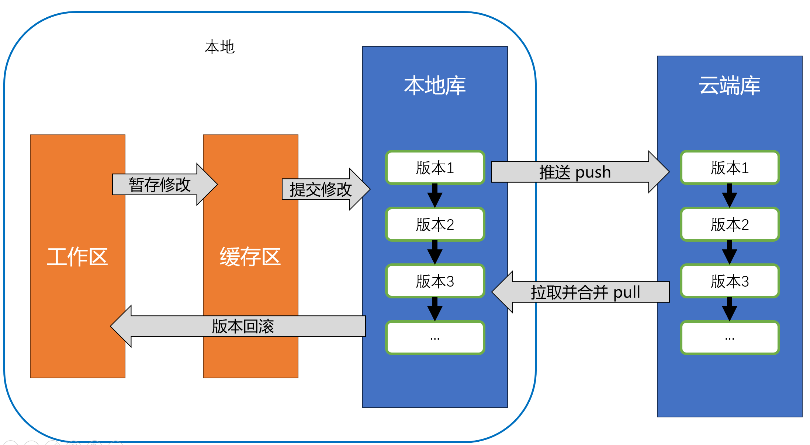

# Git 和 GitHub 使用指南

## Git工作原理和核心流程

Git是一种分布式版本控制系统，它允许你对文件修改进行记录（类似游戏存档），并支持文件版本回滚（类似游戏读档），同时允许多位开发者之间进行协作。

使用Git管理你的更改时，文件呈现3种状态：已提交、已修改、已暂存。
- 已提交，这个文件的修订已经保存于本地仓库中。
- 已暂存，这个文件已经被标记，这个文件的修改将包含在下次提交中。
- 已修改，这个文件与仓库的最新版本相比已经发生了变化，但这个修订尚未被标记。

这会让我们的 Git 项目拥有三个阶段：工作区、暂存区以及 Git 目录。
- 工作区：从Git仓库的压缩数据库中取出的文件，供你使用和修改
- 暂存区：一个文件，保存下次要提交的文件列表信息
- Git目录：Git用来保存项目的元数据和对象数据库的地方。

这个三个“区”加上云端的仓库（比如GitHub）就构成了下面的关系

Git是分布式版本控制系统，所以即使暂时连不上网，你也可以在本地仓库中暂存和提交更改，等连上网在把更新push到云端。

有关git和GitHub的更多、更全面的信息，可以参考[这个网站](https://git-scm.com/book/zh/v2/)

## 在电脑上安装和使用git

参照推文，mkdocs里图文教程不大好排版太费空间

本段内容以win电脑为例，参照[官方文档](https://git-scm.com/book/zh/v2/%E8%B5%B7%E6%AD%A5-%E5%AE%89%E8%A3%85-Git)，Linux、mac系统的git也有，请参照官方文档

1. [打开git官网](https://git-scm.com/install/windows),点那个“Click Here to Download”，运行安装程序，一路默认配置，注意不要装在c盘
2. git就装好了

## 简单概念

代码仓库：文件+文件修订记录。

推送push：将本地仓储上传，使云端仓库与本地仓库同步

拉取pull：下载云端仓库，使本地仓库与云端同步

分布式版本控制系统：相对“集中式版本控制系统”的概念。在集中式版本控制系统中，由服务器进行版本控制，客户端只从服务器取出最新版本或向服务器提交更新。而在分布式版本控制系统中，客户端在本地也能进行版本控制，与服务器的交互形式为从服务器下载仓库，或将本地仓库同步到云端。由于在分布式版本控制系统中，每个客户端都下载了完整的代码仓库，因此不那么怕由于服务器故障损失更新记录；同时，由于每个客户端能独立进行版本控制，因而也允许开发者们进行独立开发（开分支）。